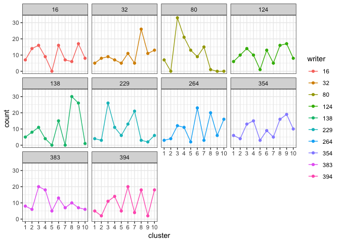
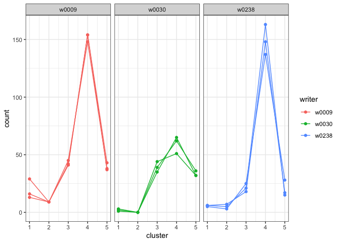
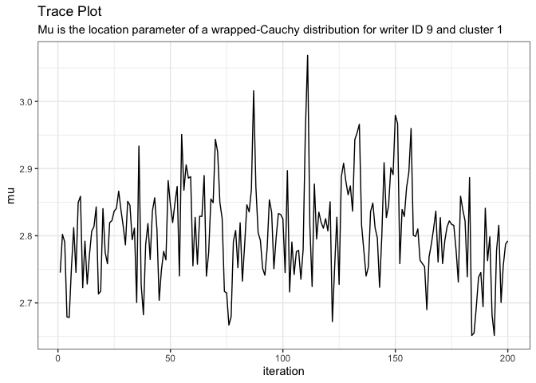
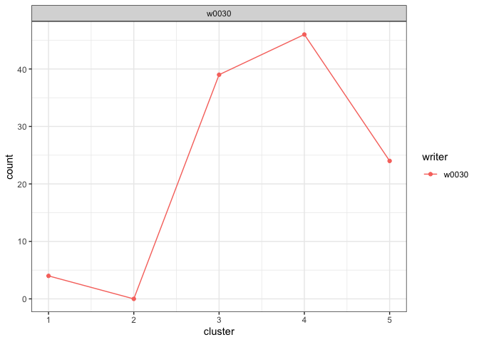

<!-- README.md is generated from README.Rmd. Please edit that file -->

# handwriter

<!-- badges: start -->
<!-- badges: end -->

The handwriter package performs writership analysis of a handwritten
*questioned document* where the questioned document was written by one
of *closed-set* of potential writers. For example, a handwritten bomb
threat is found in a science classroom, and the police are able to
determine that the note could only have been written by one of the
students in 4th period science. The handwriter package builds a
statistical model to estimate a *writer profile* from known handwriting
samples from each writer in the closed-set. A writer profile is also
estimated from the questioned document. The statistical model compares
the writer profile from the questioned document with each of the writer
profiles from the closed-set of potential writers and estimates the
posterior probability that each closed-set writer wrote the questioned
document.

## Installation

You can install handwriter from CRAN with:

``` r
install.packages("handwriter")
```

First install packages "libgit2" and "glpk" from the shell,
then you can install the development version of handwriter from
[GitHub](https://github.com/) with:

``` r
# install.packages("devtools")
devtools::install_github("CSAFE-ISU/handwriter")
```

## Process a Handwriting Example

The file “phrase_example.png” is a scanned PNG of handwriting from the
CSAFE Handwriting Database. This PNG image is included in the handwriter
package in a folder called “extdata.” Use the helper function
`handwriter_example()` to find the path to where “phrase_example.png” is
saved on your computer.

Use `processDocument()` to

1.  read the PNG file
2.  convert the writing to black and white
3.  thin it to a one-pixel-wide skeleton
4.  place nodes to break the writing into component shapes called
    *graphs*

``` r
library(handwriter)
phrase <- system.file("extdata", "phrase_example.png", package = "handwriter")
doc <- processDocument(phrase)
#> path in readPNGBinary: /private/var/folders/1z/jk9bqhdd06j1fxx0_xm2jj980000gn/T/Rtmpyq4RxB/temp_libpathcf8f41359afa/handwriter/extdata/phrase_example.png
#> Starting Processing...
#> Getting Nodes...and merging them...
#> Finding direct paths...and loops...
#> Looking for letter break points...and discarding bad ones...
#> Isolating letter paths...
#> Organizing letters...
#> Creating letter lists...
#> Adding character features...
#> Document processing complete.
```

We can view the image:

``` r
plotImage(doc)
```


We can view the thinned image:

``` r
plotImageThinned(doc)
```


We can also view the nodes:

``` r
plotNodes(doc)
```


## Perform Writership Analysis

This section explains how to perform handwriting analysis on questioned
documents using handwriter. In particular, handwriter addresses the
scenario where an investigator has a questioned handwritten document, a
group of persons of interest has been identified, and the questioned
document had to have been written by one of the persons of interest. For
example, imagine that a handwritten bomb threat was left at a office
building’s main desk and the police discover that the note had to have
been written by one of the one hundred employees working that day. More
details on this method can be found in \[Crawford 2022\].

### STEP 1: Create the Main Directory and Subdirectories

Create a new folder called `main_dir` on your computer to hold the
handwriting documents to be analyzed. When we create a new clustering
template and fit a statistical model, those files will also be stored in
this folder. Create a sub-folder in `main_dir` called `data`. In the
`data` folder, create sub-folders called `model_docs`,
`questioned_docs`, and `template_docs`. The folder structure will look
like this:

``` bash
├── main_dir
│   ├── data  
│   │   ├── model_docs
│   │   ├── questioned_docs
│   │   ├── template_docs
```

### STEP 2: Create a Cluster Template

Save the handwritten documents that you want to use to train a new
cluster template as PNG images in `main_dir > data > template_docs`. The
template training documents need to be from writers that are NOT people
of interest. Name all of the PNG images with a consistent format that
includes an ID for the writer. For example, the PNG images could be
named “writer0001.png”, “writer0002.png”, “writer0003.png” and so on.

Next, create a new cluster template from the documents in
`main_dir > data > template_docs` with the function
`make_clustering_templates`. This function

1.  Processes the template training documents in `template_docs`,
    decomposing the handwriting into component shapes called *graphs*.
    The processed graphs are saved in RDS files in
    `main_dir \> data \> template_graphs`.
2.  Deletes graphs with more than the maximum number of edges specified
    by `max_edges.`
3.  Randomly selects `K` starting cluster centers using seed
    `centers_seed` for reproducibility.
4.  Runs a K-means algorithm with the `K` starting cluster centers and
    the selected graphs. The algorithm iteratively groups the selected
    graphs into `K` clusters. The final grouping of `K` clusters is the
    cluster template.
5.  Stores the writer ID for each training document. `writer_indices` is
    a vector of the start and stop characters of the writer ID in the
    PNG image file name. For example, if the PNG images are named
    “writer0001.png”, “writer0002.png”, “writer0003.png”, and so on,
    `writer_indices = c(7,10)`
6.  Performs some of the processes in parallel. Set the number of cores
    for parallel processing with `num_dist_cores`.

``` r
template <- make_clustering_templates(
  template_dir = "path/to/main_dir",
  template_images_dir = "path/to/main_dir/data/template_docs",
  writer_indices = c(7,10),
  max_edges = 25,
  centers_seed = 100,
  graphs_seed = 101,
  K = 40,
  num_dist_cores = 4,
  max_iters = 25)
```

Type `?make_clustering_templates` in the RStudio console for more
information about the function’s arguments.

For the remainder of this tutorial, we use a small example cluster
template, `example_cluster_template` included in handwriter.

``` r
template <- example_cluster_template
```

The idea behind the cluster template and the hierarchical model is that
we can decompose a handwritten document into component graphs, assign
each graph to the *nearest* cluster, the cluster with the closest shape,
in the cluster template, and count the number of graphs in each cluster.
We characterize writers by the number of a writer’s graphs that are
assigned to each cluster. We refer to this as a writer’s *cluster fill
counts* and it serves as writer profile.

We can plot the cluster fill counts for each writer in the template
training set. First we format the template data to get the cluster fill
counts in the proper format for the plotting function.

``` r
template_data <- format_template_data(template = template)
plot_cluster_fill_counts(template_data, facet = TRUE)
```



### STEP 3: Fit a Hierarchical Model

We will use handwriting samples from each person of interest, calculate
the cluster fill counts from each sample using the cluster template, and
fit a hierarchical model to estimate each person of interest’s true
cluster fill counts.

Save your known handwriting samples from the persons of interest in
`main_dir \> data \> model_docs` as PNG images. The model requires three
handwriting samples from each person of interest. Each sample should be
at least one paragraph in length. Name the PNG images with a consistent
format so that all file names are the same length and the writer ID’s
are in the same location. For example, “writer0001_doc1.png”,
“writer0001_doc2.png”, “writer0001_doc3.png”, “writer0002_doc1.png”, and
so on.

We fit a hierarchical model with the function `fit_model`. This function
does the following:

1.  Processes the model training documents in `model_images_dir`,
    decomposing the handwriting into component graphs. The processed
    graphs are saved in RDS files in `main_dir \> data \> model_graphs`.
2.  Calculates the cluster fill counts for each document by assigning
    each graph to the nearest cluster in the cluster template and
    counting the number of graphs assigned to each cluster. The cluster
    assignments are saved in main_dir \> data \> model_clusters.rds
3.  Fits a hierarchical model to the cluster fill counts using the RJAGS
    package and draws posterior samples of model parameters with the
    coda package.

In this example, we use 4000 MCMC iterations for the model. The inputs
`writer_indices` and `doc_indices` are the starting and stopping
characters in the model training documents file names that contains the
writer ID and a document name.

``` r
model <- fit_model(template_dir = "path/to/main_dir", 
                   model_images_dir = "path/to/main_dir/data/model_docs",
                   num_iters = 4000, 
                   num_chains = 1, 
                   num_cores = 2,
                   writer_indices = c(7, 10), 
                   doc_indices = c(11, 14))
```

For this tutorial, we will use the small example model,
`example_model_1chain`, included in handwriter. This model was trained
from three documents each from writers 9, 30, 203, 238, and 400 from the
[CSAFE handwriting
database](https://data.csafe.iastate.edu/HandwritingDatabase/).

``` r
model <- example_model_1chain
```

We can plot the cluster fill counts for each person of interest. (NOTE:
We had to format the template data to work with the plotting function,
but the model data is already in the correct format.)

``` r
plot_cluster_fill_counts(formatted_data=model, facet = TRUE)
```

 The
bars across the top of each graph show the Writer ID. Each graph has a
line for each known handwriting sample from a given writer.

#### Hierarchical Model Variables and Burn-in

If you are interested in the variables used by the hierarchical model,
continue reading this section. Otherwise, feel free to skip to the next
section to learn how to analyze questioned documents.

We can list the variables in the model:

``` r
names(as.data.frame(coda::as.mcmc(model$fitted_model[[1]])))
#>   [1] "eta[1]"    "eta[2]"    "eta[3]"    "eta[4]"    "eta[5]"    "eta[6]"   
#>   [7] "eta[7]"    "eta[8]"    "eta[9]"    "eta[10]"   "gamma[1]"  "gamma[2]" 
#>  [13] "gamma[3]"  "gamma[4]"  "gamma[5]"  "gamma[6]"  "gamma[7]"  "gamma[8]" 
#>  [19] "gamma[9]"  "gamma[10]" "mu[1,1]"   "mu[2,1]"   "mu[3,1]"   "mu[4,1]"  
#>  [25] "mu[5,1]"   "mu[1,2]"   "mu[2,2]"   "mu[3,2]"   "mu[4,2]"   "mu[5,2]"  
#>  [31] "mu[1,3]"   "mu[2,3]"   "mu[3,3]"   "mu[4,3]"   "mu[5,3]"   "mu[1,4]"  
#>  [37] "mu[2,4]"   "mu[3,4]"   "mu[4,4]"   "mu[5,4]"   "mu[1,5]"   "mu[2,5]"  
#>  [43] "mu[3,5]"   "mu[4,5]"   "mu[5,5]"   "mu[1,6]"   "mu[2,6]"   "mu[3,6]"  
#>  [49] "mu[4,6]"   "mu[5,6]"   "mu[1,7]"   "mu[2,7]"   "mu[3,7]"   "mu[4,7]"  
#>  [55] "mu[5,7]"   "mu[1,8]"   "mu[2,8]"   "mu[3,8]"   "mu[4,8]"   "mu[5,8]"  
#>  [61] "mu[1,9]"   "mu[2,9]"   "mu[3,9]"   "mu[4,9]"   "mu[5,9]"   "mu[1,10]" 
#>  [67] "mu[2,10]"  "mu[3,10]"  "mu[4,10]"  "mu[5,10]"  "pi[1,1]"   "pi[2,1]"  
#>  [73] "pi[3,1]"   "pi[4,1]"   "pi[5,1]"   "pi[1,2]"   "pi[2,2]"   "pi[3,2]"  
#>  [79] "pi[4,2]"   "pi[5,2]"   "pi[1,3]"   "pi[2,3]"   "pi[3,3]"   "pi[4,3]"  
#>  [85] "pi[5,3]"   "pi[1,4]"   "pi[2,4]"   "pi[3,4]"   "pi[4,4]"   "pi[5,4]"  
#>  [91] "pi[1,5]"   "pi[2,5]"   "pi[3,5]"   "pi[4,5]"   "pi[5,5]"   "pi[1,6]"  
#>  [97] "pi[2,6]"   "pi[3,6]"   "pi[4,6]"   "pi[5,6]"   "pi[1,7]"   "pi[2,7]"  
#> [103] "pi[3,7]"   "pi[4,7]"   "pi[5,7]"   "pi[1,8]"   "pi[2,8]"   "pi[3,8]"  
#> [109] "pi[4,8]"   "pi[5,8]"   "pi[1,9]"   "pi[2,9]"   "pi[3,9]"   "pi[4,9]"  
#> [115] "pi[5,9]"   "pi[1,10]"  "pi[2,10]"  "pi[3,10]"  "pi[4,10]"  "pi[5,10]" 
#> [121] "tau[1,1]"  "tau[2,1]"  "tau[3,1]"  "tau[4,1]"  "tau[5,1]"  "tau[1,2]" 
#> [127] "tau[2,2]"  "tau[3,2]"  "tau[4,2]"  "tau[5,2]"  "tau[1,3]"  "tau[2,3]" 
#> [133] "tau[3,3]"  "tau[4,3]"  "tau[5,3]"  "tau[1,4]"  "tau[2,4]"  "tau[3,4]" 
#> [139] "tau[4,4]"  "tau[5,4]"  "tau[1,5]"  "tau[2,5]"  "tau[3,5]"  "tau[4,5]" 
#> [145] "tau[5,5]"  "tau[1,6]"  "tau[2,6]"  "tau[3,6]"  "tau[4,6]"  "tau[5,6]" 
#> [151] "tau[1,7]"  "tau[2,7]"  "tau[3,7]"  "tau[4,7]"  "tau[5,7]"  "tau[1,8]" 
#> [157] "tau[2,8]"  "tau[3,8]"  "tau[4,8]"  "tau[5,8]"  "tau[1,9]"  "tau[2,9]" 
#> [163] "tau[3,9]"  "tau[4,9]"  "tau[5,9]"  "tau[1,10]" "tau[2,10]" "tau[3,10]"
#> [169] "tau[4,10]" "tau[5,10]"
```

View a description of a variable with the `about_variable` function.

``` r
about_variable(variable = "mu[1,1]", model = model)
#> [1] "Mu is the location parameter of a wrapped-Cauchy distribution for writer ID 9 and cluster 1"
```

View a trace plot of a variable.

``` r
plot_trace(variable = "mu[1,1]", model = model)
```



If we need to, we can drop the beginning MCMC iterations for burn-in.
For example, if we want to drop the first 25 iterations, we use

``` r
model <- drop_burnin(model, burn_in = 25)
```

If we want to save the updated model as the current model for this
project, replace `model.rds` in the `data` folder with

``` r
saveRDS(model, file='data/model.rds')
```

### Analyze Questioned Documents

Save your questioned document(s) in `main_dir > data > questioned_docs`
as PNG images. Assign a new writer ID to the questioned documents and
name the documents consistently. E.g. “unknown1000_doc1.png”,
“unknown1001_doc1.png”, and so on.

We estimate the posterior probability of writership for each of the
questioned documents with the function `analyze_questioned_documents`.
This function does the following:

1.  **Process Questioned Document(s):** Processes the questioned
    documents in `questioned_images_dir`, decomposing the handwriting
    into component graphs. The processed graphs are saved in RDS files
    in `main_dir \> data \> questioned_graphs`.
2.  **Estimate the Writer Profile of the Questioned Document(s):**
    Calculates the cluster fill counts for each questioned document by
    assigning each graph to the nearest cluster in the cluster template
    and counting the number of graphs assigned to each cluster. The
    cluster assignments are saved in
    `main_dir \> data \> questioned_clusters.rds`.
3.  **Estimate the Posterior Probability of Writership:** Uses the
    fitted model from Step 3 to estimate the posterior probability of
    writership for each questioned document and each person of interest.
    The results are saved in `main_dir \> data \> analysis.rds`.

``` r
analysis <- analyze_questioned_documents(
  template_dir = "path/to/main_dir", 
  questioned_images_dir = "path/to/main_dir/questioned_docs", 
  model = model, 
  writer_indices = c(8,11),
  doc_indices = c(13,16),
  num_cores = 2)
```

Let’s pretend that a handwriting sample from each of the 5 “persons of
interest” is a questioned document. These documents are also from the
[CSAFE handwriting
database](https://data.csafe.iastate.edu/HandwritingDatabase/) and have
already been analyzed with `example_model_1chain` and the results are
included in handwriter as `example_analysis_1chain`.

``` r
analysis <- example_analysis_1chain
```

View the cluster fill counts for each questioned document. Intuitively,
the model assesses which writer’s cluster fill counts look the most like
the cluster fill counts observed in each questioned document.

``` r
plot_cluster_fill_counts(analysis, facet = TRUE)
```



View the posterior probabilities of writership.

``` r
analysis$posterior_probabilities
#>       known_writer w0009_s03_pWOZ_r01.png w0030_s03_pWOZ_r01.png
#> 1   known_writer_9                      1                      0
#> 2  known_writer_30                      0                      1
#> 3 known_writer_203                      0                      0
#> 4 known_writer_238                      0                      0
#> 5 known_writer_400                      0                      0
#>   w0203_s03_pWOZ_r01.png w0238_s03_pWOZ_r01.png w0400_s03_pWOZ_r01.png
#> 1                    0.0                      0                      0
#> 2                    0.0                      0                      0
#> 3                    0.3                      0                      0
#> 4                    0.7                      1                      0
#> 5                    0.0                      0                      1
```

#### For Research Only

In practice, we would not know who wrote a questioned document, but in
research we often perform tests to evaluate models using data where we
know the ground truth. Because in this example, we know the true writer
of each questioned document, we can measure the accuracy of the model.
We define accuracy as the average posterior probability assigned to the
true writer. The accuracy of our model is

``` r
calculate_accuracy(analysis)
#> [1] 0.86
```
