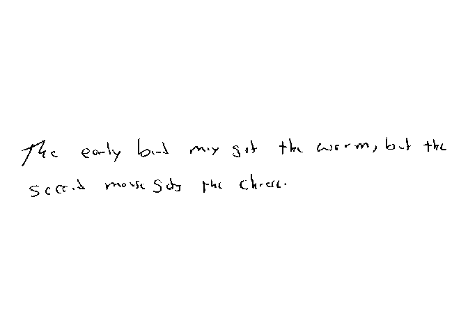

<!-- README.md is generated from README.Rmd. Please edit that file -->

# handwriter

<!-- badges: start -->
<!-- badges: end -->

The handwriter package performs writership analysis of a handwritten
*questioned document* where the questioned document was written by one
of *closed-set* of potential writers. For example, a handwritten bomb
threat is found in a science classroom, and the police are able to
determine that the note could only have been written by one of the
students in 4th period science. The handwriter package builds a
statistical model to estimate a *writer profile* from known handwriting
samples from each writer in the closed-set. A writer profile is also
estimated from the questioned document. The statistical model compares
the writer profile from the questioned document with each of the writer
profiles from the closed-set of potential writers and estimates the
posterior probability that each closed-set writer wrote the questioned
document.

## Installation

You can install handwriter from CRAN with:

``` r
install.packages("handwriter")
```

You can install the development version of handwriter from
[GitHub](https://github.com/) with:

``` r
# install.packages("devtools")
devtools::install_github("CSAFE-ISU/handwriter")
```

## Example

The file “phrase_example.png” is a scanned PNG of handwriting from the
CSAFE Handwriting Database. This PNG image is included in the handwriter
package in a folder called “extdata.” Use the helper function
`handwriter_example()` to find the path to where “phrase_example.png” is
saved on your computer.

Use `processDocument()` to

1.  read the PNG file
2.  convert the writing to black and white
3.  thin it to a one-pixel-wide skeleton
4.  place nodes to break the writing into component shapes called
    *graphs*

``` r
library(handwriter)
phrase <- handwriter_example(path="phrase_example.png")
doc <- processDocument(path=phrase)
#> path in readPNGBinary: /private/var/folders/1z/jk9bqhdd06j1fxx0_xm2jj980000gn/T/RtmpPv8XMT/temp_libpath10c082458606d/handwriter/extdata/phrase_example.png
#> Starting Processing...
#> Getting Nodes...and merging them...
#> Finding direct paths...and loops...
#> Looking for letter break points...and discarding bad ones...
#> Isolating letter paths...
#> Organizing letters...
#> Creating letter lists...
#> Adding character features...
#> Document processing complete.
```

We can view the image:

``` r
plotImage(doc)
```



We can view the thinned image:

``` r
plotImageThinned(doc)
```


We can also view the nodes:

``` r
plotNodes(doc)
```


