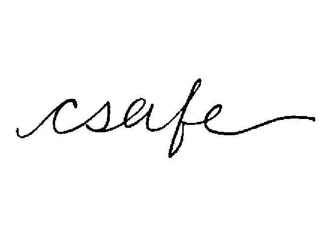
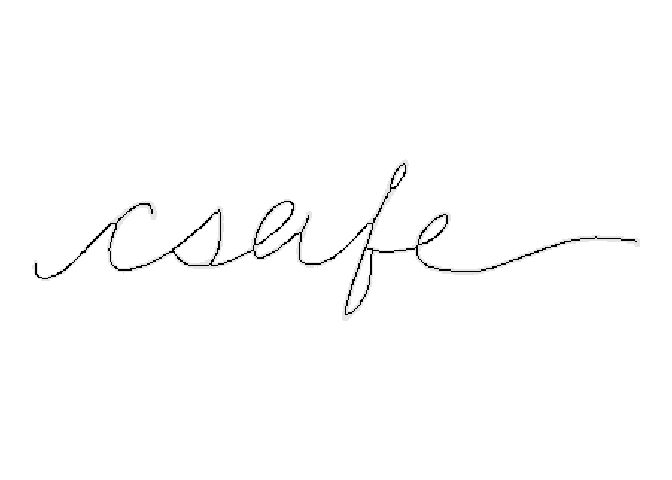

# Cursive written word: csafe

## Description

Cursive written word: csafe

## Usage

<pre><code class='language-R'>csafe
</code></pre>

## Format

Binary image matrix. 111 rows and 410 columns.

## Examples

``` r
library(handwriter)

csafe_document <- list()
csafe_document$image <- csafe
plotImage(csafe_document)
```



``` r
csafe_document$thin <- thinImage(csafe_document$image)
plotImageThinned(csafe_document)
```



``` r
csafe_processList <- processHandwriting(csafe_document$thin, dim(csafe_document$image))
```
