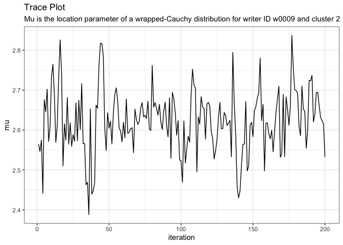

# Drop Burn-In

[**Source code**](https://github.com/CSAFE-ISU/handwriter/tree/176-automatic-documentation/R/#L)

## Description

<code>drop_burnin()</code> removes the burn-in from the Markov Chain
Monte Carlo (MCMC) draws.

## Usage

<pre><code class='language-R'>drop_burnin(model, burn_in)
</code></pre>

## Arguments

<table>
<tr>
<td style="white-space: nowrap; font-family: monospace; vertical-align: top">
<code id="model">model</code>
</td>
<td>
A list of MCMC draws from a model fit with <code>fit_model()</code>.
</td>
</tr>
<tr>
<td style="white-space: nowrap; font-family: monospace; vertical-align: top">
<code id="burn_in">burn_in</code>
</td>
<td>
An integer number of starting iterations to drop from each MCMC chain.
</td>
</tr>
</table>

## Value

A list of data frames of MCMC draws with burn-in dropped.

## Examples

``` r
library(handwriter)

model <- drop_burnin(model = example_model, burn_in = 25)
plot_trace(variable = "mu[1,2]", model = example_model)
```


