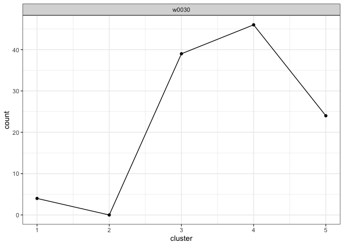

# Example of writership analysis

## Description

Example of writership analysis

## Usage

<pre><code class='language-R'>example_analysis
</code></pre>

## Format

The results of <code>analyze_questioned_documents()</code> stored in a
named list with 5 items:

<dl>
<dt>
graph_measurements
</dt>
<dd>
A data frame of that shows the writer, document name, cluster
assignment, slope, principle component rotation angle, and wrapped
principle component rotation angle for each training graph in each
questioned documents.
</dd>
<dt>
cluster_fill_counts
</dt>
<dd>
A data frame of the cluster fill counts for each questioned document.
</dd>
<dt>
likelihoods
</dt>
<dd>
A list of data frames where each data frame contains the likelihoods for
a questioned document for each MCMC iteration.
</dd>
<dt>
votes
</dt>
<dd>
A list of vote tallies for each questioned document.
</dd>
<dt>
posterior_probabilites
</dt>
<dd>
A list of posterior probabilities of writership for each questioned
document and each known writer in the closed set used to train the
hierarchical model.
</dd>
</dl>

## Examples

``` r
library(handwriter)

plot_cluster_fill_counts(formatted_data = example_analysis)
```



``` r
plot_posterior_probabilities(analysis = example_analysis)
```


