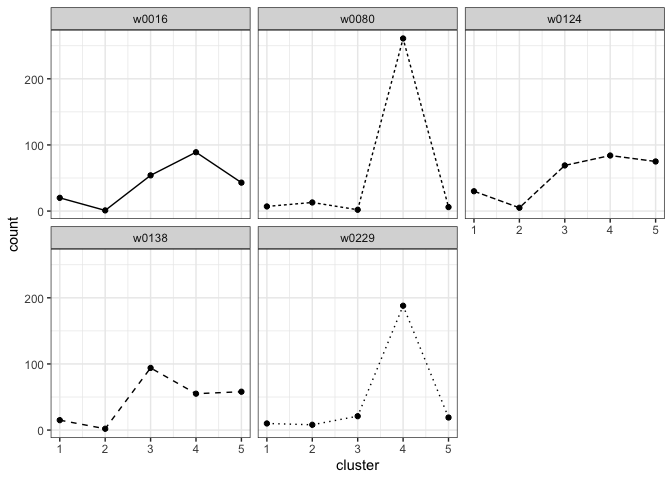

# Example cluster template

## Description

An example cluster template created with
<code>make_clustering_template()</code>. The cluster template was
created from handwriting samples "w0016_s01_pLND_r01.png",
"w0080_s01_pLND_r01.png", "w0124_s01_pLND_r01.png",
"w0138_s01_pLND_r01.png", and "w0299_s01_pLND_r01.png" from the CSAFE
Handwriting Database. The template has K=5 clusters.

## Usage

<pre><code class='language-R'>example_cluster_template
</code></pre>

## Format

A list containing a single cluster template created by
<code>make_clustering_template()</code>. The cluster template was
created by sorting a random sample of 1000 graphs from 10 training
documents into 10 clusters with a K-means algorithm. The cluster
template is a named list with 16 items:

<dl>
<dt>
centers_seed
</dt>
<dd>
An integer for the random number generator.
</dd>
<dt>
cluster
</dt>
<dd>
A vector of cluster assignments for each graph used to create the
cluster template.
</dd>
<dt>
centers
</dt>
<dd>
The final cluster centers produced by the K-Means algorithm.
</dd>
<dt>
K
</dt>
<dd>
The number of clusters to build (10) with the K-means algorithm.
</dd>
<dt>
n
</dt>
<dd>
The number of training graphs to use (1000) in the K-means algorithm.
</dd>
<dt>
docnames
</dt>
<dd>
A vector that lists the training document from which each graph
originated.
</dd>
<dt>
writers
</dt>
<dd>
A vector that lists the writer of each graph.
</dd>
<dt>
iters
</dt>
<dd>
The maximum number of iterations for the K-means algorithm (3).
</dd>
<dt>
changes
</dt>
<dd>
A vector of the number of graphs that changed clusters on each iteration
of the K-means algorithm.
</dd>
<dt>
outlierCutoff
</dt>
<dd>
A vector of the outlier cutoff values calculated on each iteration of
the K-means algorithm.
</dd>
<dt>
stop_reason
</dt>
<dd>
The reason the K-means algorithm terminated.
</dd>
<dt>
wcd
</dt>
<dd>
A matrix of the within cluster distances on each iteration of the
K-means algorithm. More specifically, the distance between each graph
and the center of the cluster to which it was assigned on each
iteration.
</dd>
<dt>
wcss
</dt>
<dd>
A vector of the within-cluster sum of squares on each iteration of the
K-means algorithm.
</dd>
</dl>

## Examples

``` r
library(handwriter)

# view cluster fill counts for template training documents
template_data <- format_template_data(example_cluster_template)
plot_cluster_fill_counts(template_data, facet = TRUE)
```


