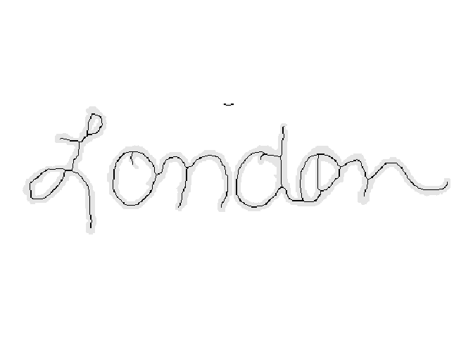

# Cursive written word: London

## Description

Cursive written word: London

## Usage

<pre><code class='language-R'>london
</code></pre>

## Format

Binary image matrix. 148 rows and 481 columns.

## Examples

``` r
library(handwriter)

london_document <- list()
london_document$image <- london
plotImage(london_document)
```


``` r
london_document$thin <- thinImage(london_document$image)
plotImageThinned(london_document)
```



``` r
london_processList <- processHandwriting(london_document$thin, dim(london_document$image))
```
