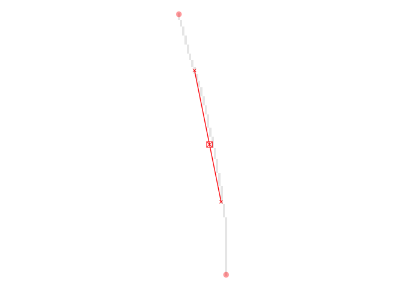

# Plot Letter

[**Source code**](https://github.com/CSAFE-ISU/handwriter/tree/176-automatic-documentation/R/#L)

## Description

This function returns a plot of a single graph extracted from a
document. It uses the letterList parameter from the
<code>processHandwriting()</code> or <code>processDocument()</code>
function and accepts a single value as <code>whichLetter</code>. Dims
requires the dimensions of the entire document, since this isn’t
contained in <code>processHandwriting()</code> or
<code>processDocument()</code>.

## Usage

<pre><code class='language-R'>plotLetter(
  doc,
  whichLetter,
  showPaths = TRUE,
  showCentroid = TRUE,
  showSlope = TRUE,
  showNodes = TRUE
)
</code></pre>

## Arguments

<table>
<tr>
<td style="white-space: nowrap; font-family: monospace; vertical-align: top">
<code id="doc">doc</code>
</td>
<td>
A document processed with <code>processHandwriting()</code> or
<code>processDocument()</code>
</td>
</tr>
<tr>
<td style="white-space: nowrap; font-family: monospace; vertical-align: top">
<code id="whichLetter">whichLetter</code>
</td>
<td>
Single value in 1:length(letterList) denoting which letter to plot.
</td>
</tr>
<tr>
<td style="white-space: nowrap; font-family: monospace; vertical-align: top">
<code id="showPaths">showPaths</code>
</td>
<td>
Whether the calculated paths on the letter should be shown with numbers.
</td>
</tr>
<tr>
<td style="white-space: nowrap; font-family: monospace; vertical-align: top">
<code id="showCentroid">showCentroid</code>
</td>
<td>
Whether the centroid should be shown
</td>
</tr>
<tr>
<td style="white-space: nowrap; font-family: monospace; vertical-align: top">
<code id="showSlope">showSlope</code>
</td>
<td>
Whether the slope should be shown
</td>
</tr>
<tr>
<td style="white-space: nowrap; font-family: monospace; vertical-align: top">
<code id="showNodes">showNodes</code>
</td>
<td>
Whether the nodes should be shown
</td>
</tr>
</table>

## Value

Plot of single letter.

## Examples

``` r
library(handwriter)

twoSent_document = list()
twoSent_document$image = twoSent
twoSent_document$thin = thinImage(twoSent_document$image)
twoSent_document$process = processHandwriting(twoSent_document$thin, dim(twoSent_document$image))
plotLetter(twoSent_document, 1)
```


``` r
plotLetter(twoSent_document, 4, showPaths = FALSE)
```


