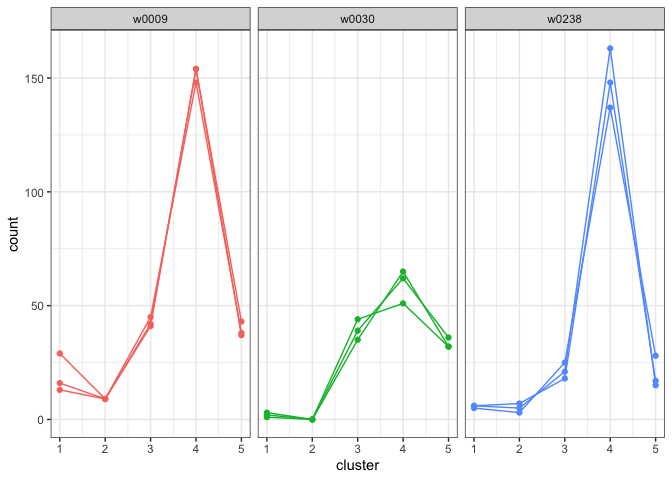
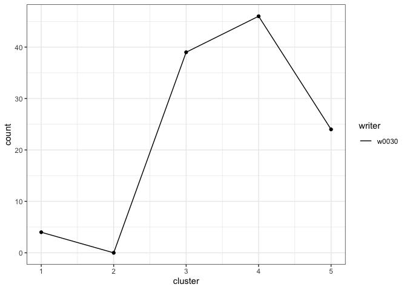

# Plot Cluster Fill Counts

[**Source code**](https://github.com/CSAFE-ISU/handwriter/tree/176-automatic-documentation/R/#L)

## Description

Plot the cluster fill counts for each document in
<code>formatted_data</code>.

## Usage

<pre><code class='language-R'>plot_cluster_fill_counts(formatted_data, facet = TRUE)
</code></pre>

## Arguments

<table>
<tr>
<td style="white-space: nowrap; font-family: monospace; vertical-align: top">
<code id="formatted_data">formatted_data</code>
</td>
<td>
Data created by <code>format_template_data()</code>,
<code>fit_model()</code>, or <code>analyze_questioned_documents()</code>
</td>
</tr>
<tr>
<td style="white-space: nowrap; font-family: monospace; vertical-align: top">
<code id="facet">facet</code>
</td>
<td>
<code>TRUE</code> uses <code>facet_wrap</code> to create a subplot for
each writer. <code>FALSE</code> plots the data on a single plot.
</td>
</tr>
</table>

## Value

ggplot plot of cluster fill counts

## Examples

``` r
library(handwriter)

# Plot cluster fill counts for template training documents
template_data <- format_template_data(example_cluster_template)
plot_cluster_fill_counts(formatted_data = template_data, facet = TRUE)
```


``` r
# Plot cluster fill counts for model training documents
plot_cluster_fill_counts(formatted_data = example_model, facet = TRUE)
```



``` r
# Plot cluster fill counts for questioned documents
plot_cluster_fill_counts(formatted_data = example_analysis, facet = FALSE)
```


