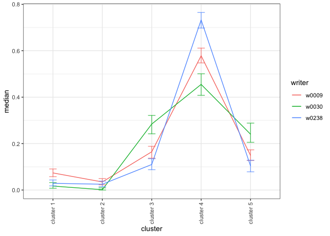
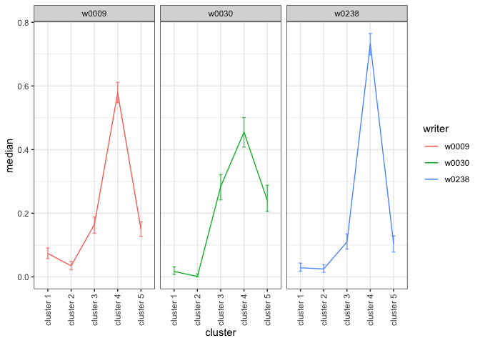

# Plot Credible Intervals

[**Source code**](https://github.com/CSAFE-ISU/handwriter/tree/176-automatic-documentation/R/#L)

## Description

Plot credible intervals for the model’s pi parameters that estimate the
true writer cluster fill counts.

## Usage

<pre><code class='language-R'>plot_credible_intervals(
  model,
  interval_min = 0.025,
  interval_max = 0.975,
  facet = FALSE
)
</code></pre>

## Arguments

<table>
<tr>
<td style="white-space: nowrap; font-family: monospace; vertical-align: top">
<code id="model">model</code>
</td>
<td>
A model created by <code>fit_model()</code>
</td>
</tr>
<tr>
<td style="white-space: nowrap; font-family: monospace; vertical-align: top">
<code id="interval_min">interval_min</code>
</td>
<td>
The lower bound of the credible interval. It must be greater than zero
and less than 1.
</td>
</tr>
<tr>
<td style="white-space: nowrap; font-family: monospace; vertical-align: top">
<code id="interval_max">interval_max</code>
</td>
<td>
The upper bound of the credible interval. It must be greater than the
interval minimum and less than 1.
</td>
</tr>
<tr>
<td style="white-space: nowrap; font-family: monospace; vertical-align: top">
<code id="facet">facet</code>
</td>
<td>
<code>TRUE</code> uses <code>facet_wrap</code> to create a subplot for
each writer. <code>FALSE</code> plots the data on a single plot.
</td>
</tr>
</table>

## Value

ggplot plot credible intervals

## Examples

``` r
library(handwriter)

plot_credible_intervals(model = example_model)
```



``` r
plot_credible_intervals(model = example_model, facet = TRUE)
```


