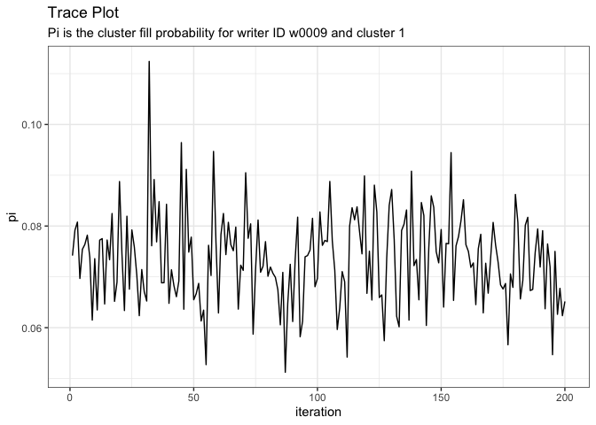
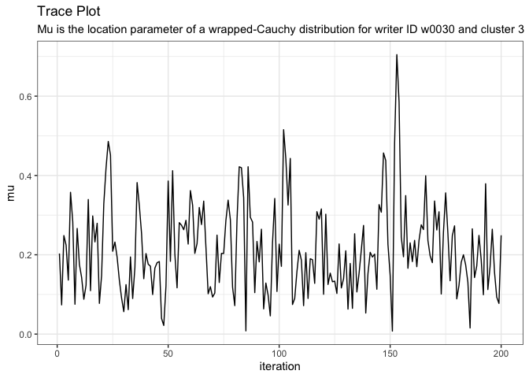

# Plot Trace

[**Source code**](https://github.com/CSAFE-ISU/handwriter/tree/176-automatic-documentation/R/#L)

## Description

Create a trace plot for all chains for a single variable of a fitted
model created by <code>fit_model()</code>. If the model contains more
than one chain, the chains will be combined by pasting them together.

## Usage

<pre><code class='language-R'>plot_trace(variable, model)
</code></pre>

## Arguments

<table>
<tr>
<td style="white-space: nowrap; font-family: monospace; vertical-align: top">
<code id="variable">variable</code>
</td>
<td>
The name of a variable in the model
</td>
</tr>
<tr>
<td style="white-space: nowrap; font-family: monospace; vertical-align: top">
<code id="model">model</code>
</td>
<td>
A model created by <code>fit_model()</code>
</td>
</tr>
</table>

## Value

A trace plot

## Examples

``` r
library(handwriter)

plot_trace(model = example_model, variable = "pi[1,1]")
```



``` r
plot_trace(model = example_model, variable = "mu[2,3]")
```


