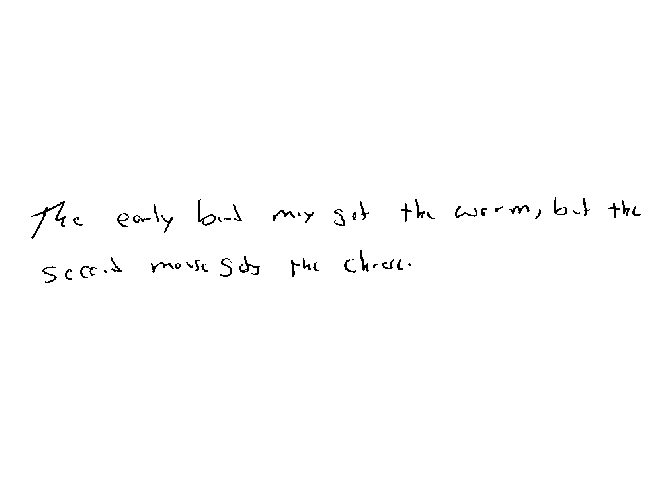
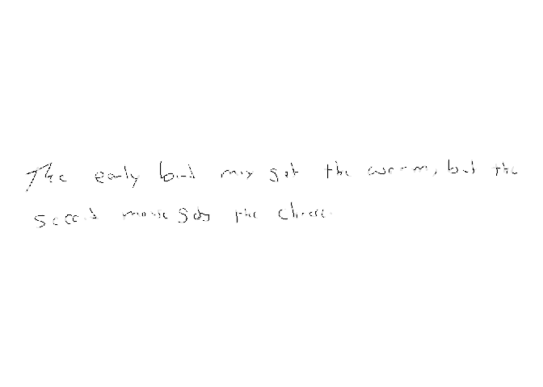
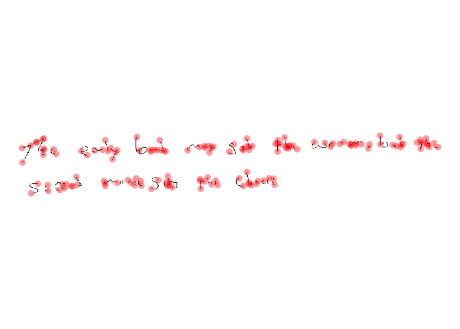

# Process Document

[**Source code**](https://github.com/CSAFE-ISU/handwriter/tree/176-automatic-documentation/R/#L)

## Description

Load a handwriting sample from a PNG image. Then binarize, thin, and
split the handwriting into graphs.

## Usage

<pre><code class='language-R'>processDocument(path)
</code></pre>

## Arguments

<table>
<tr>
<td style="white-space: nowrap; font-family: monospace; vertical-align: top">
<code id="path">path</code>
</td>
<td>
File path for handwriting document. The document must be in PNG file
format.
</td>
</tr>
</table>

## Value

The processed document as a list

## Examples

``` r
library(handwriter)

image_path <- system.file("extdata", "phrase_example.png", package = "handwriter")
doc <- processDocument(image_path)
plotImage(doc)
```



``` r
plotImageThinned(doc)
```



``` r
plotNodes(doc)
```


