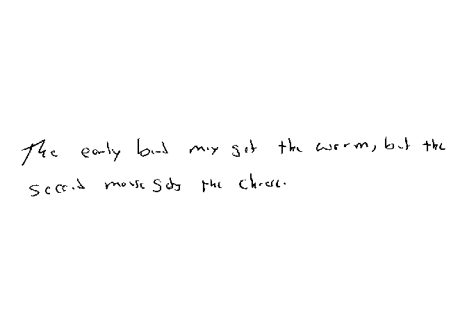

# Read PNG Binary

[**Source code**](https://github.com/CSAFE-ISU/handwriter/tree/176-automatic-documentation/R/#L)

## Description

This function reads in and binarizes a PNG image.

## Usage

<pre><code class='language-R'>readPNGBinary(
  path,
  cutoffAdjust = 0,
  clean = TRUE,
  crop = TRUE,
  inversion = FALSE
)
</code></pre>

## Arguments

<table>
<tr>
<td style="white-space: nowrap; font-family: monospace; vertical-align: top">
<code id="path">path</code>
</td>
<td>
File path for image.
</td>
</tr>
<tr>
<td style="white-space: nowrap; font-family: monospace; vertical-align: top">
<code id="cutoffAdjust">cutoffAdjust</code>
</td>
<td>
Multiplicative adjustment to the K-means estimated binarization cutoff.
</td>
</tr>
<tr>
<td style="white-space: nowrap; font-family: monospace; vertical-align: top">
<code id="clean">clean</code>
</td>
<td>
Whether to fill in white pixels with 7 or 8 neighbors. This will help a
lot when thinning – keeps from getting little white bubbles in text.
</td>
</tr>
<tr>
<td style="white-space: nowrap; font-family: monospace; vertical-align: top">
<code id="crop">crop</code>
</td>
<td>
Logical value dictating whether or not to crop the white out around the
image. TRUE by default.
</td>
</tr>
<tr>
<td style="white-space: nowrap; font-family: monospace; vertical-align: top">
<code id="inversion">inversion</code>
</td>
<td>
Logical value dictating whether or not to flip each pixel of binarized
image. Flipping happens after binarization. FALSE by default.
</td>
</tr>
</table>

## Value

Returns image from path. 0 represents black, and 1 represents white by
default.

## Examples

``` r
library(handwriter)

image_path <- system.file("extdata", "phrase_example.png", package = "handwriter")
csafe_document <- list()
csafe_document$image = readPNGBinary(image_path)
plotImage(csafe_document)
```


